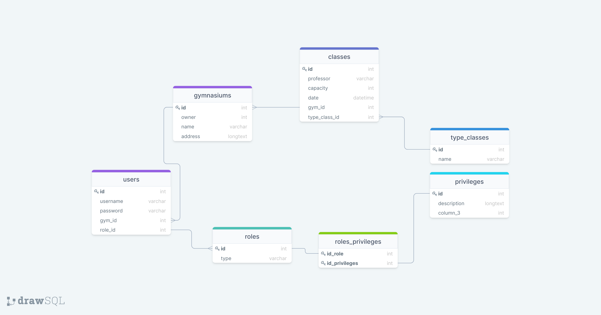

# YourTicket v0.0.1-a
## App para reservar clases en diferentes gimnasios.
***
### Requerimientos:
 - __Roles de usuarios__: Se necesitaran roles como dueños del gimnasio y otro como cliente del gimasio (admin/usuario)
 - __Diferentes "vistas"__: Dependiendo del rol del usuario, dependera a que pueda acceder.
 - __Creacion de clases__: Cada *dueño* puede crear diferentes clases, con diferentes propiedades. ej: Zumba, Funcional, etc ...
 - __Inscripcion a un gimasio__: Un usuario puede inscribirse a un gimnasio. 
 - __Reservar a una clase__: Un usuario reserva a una clase, eligiendo fecha y hora
***
### Diagrama DER:
